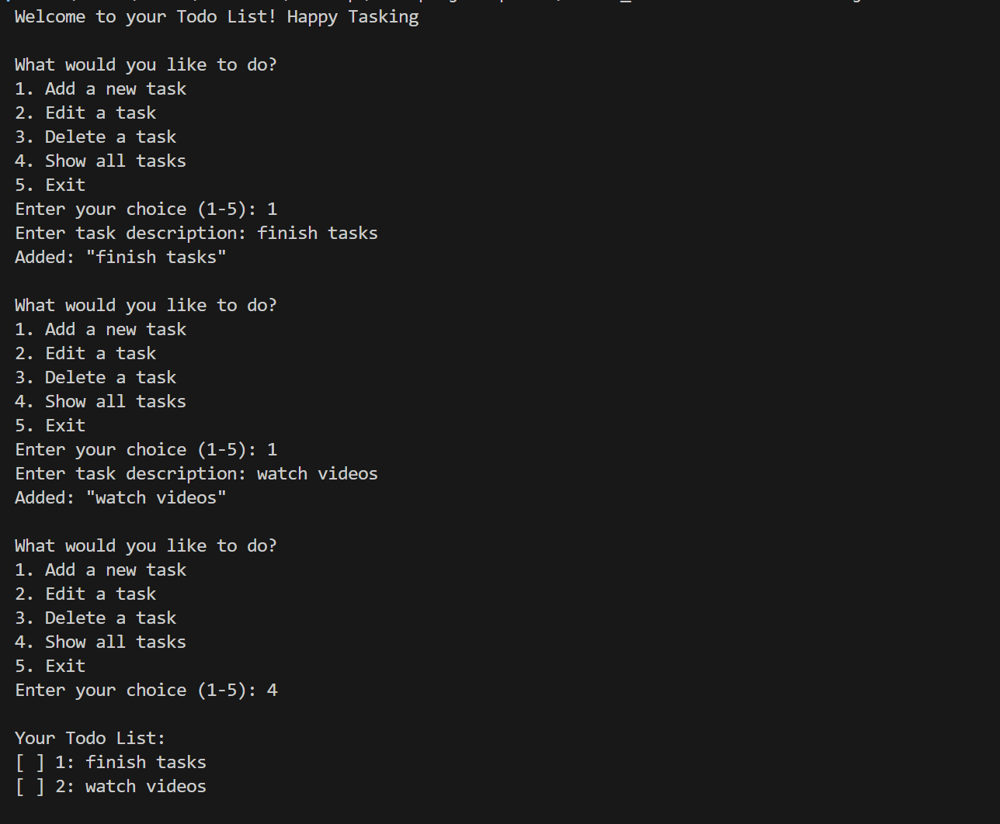
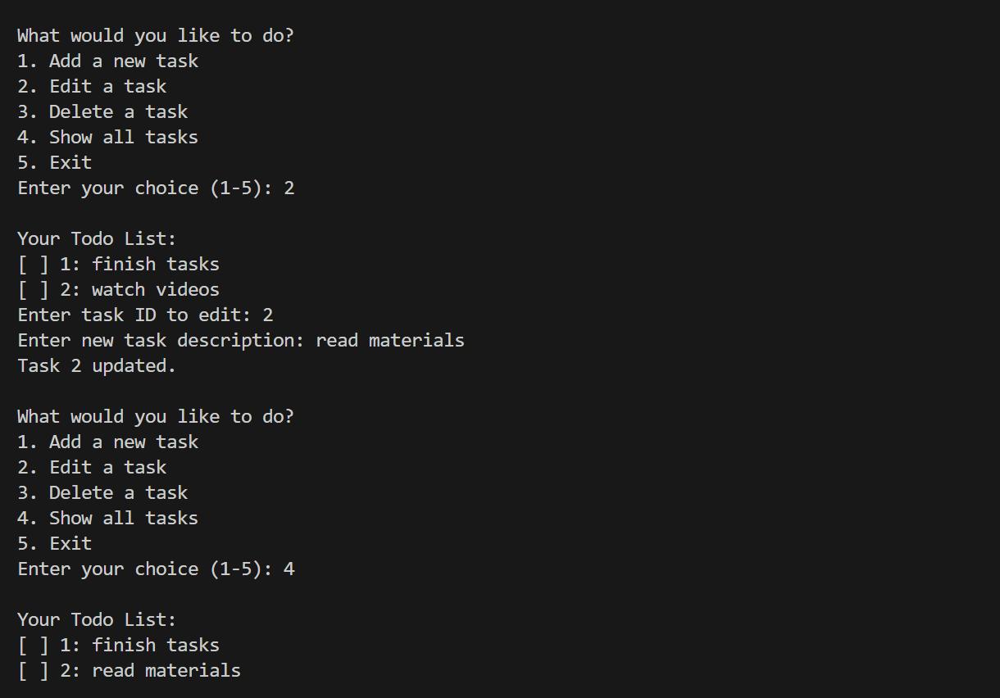
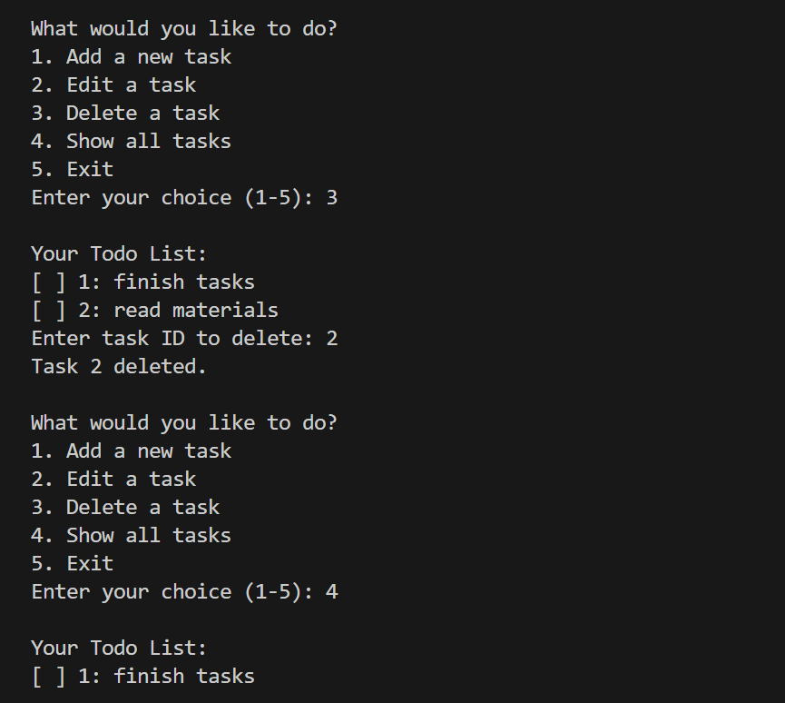
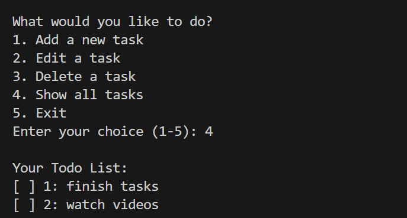

TypeScript Todo List App

This is a simple command-line Todo List application built using TypeScript. It allows users to add, edit, delete, and view tasks through an interactive terminal interface.

 Features

- Add new tasks
- Edit existing tasks
- Delete tasks
- Display the list of tasks

Functionalities

Add Task
This feature allows the user to enter a new task description. The task is added to the list with a unique ID.

Edit Task
This feature lets the user update the description of an existing task by entering its ID and a new task name.

Delete Task
This allows the user to remove a task from the list by entering its ID. The task is then permanently deleted.

Display Tasks
This displays all current tasks in the list, showing each task's ID and description.

 How to Use

1. Clone or download the repository.
2. Open the project in your code editor.
3. Compile the TypeScript file and run the JavaScript output.
4. Follow the prompts in the terminal to interact with the todo list.