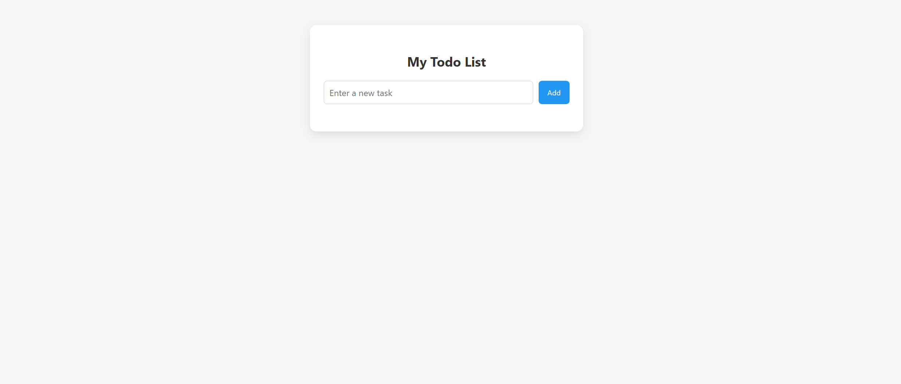
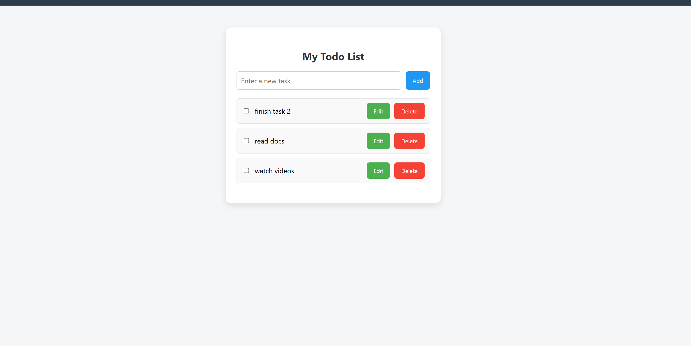
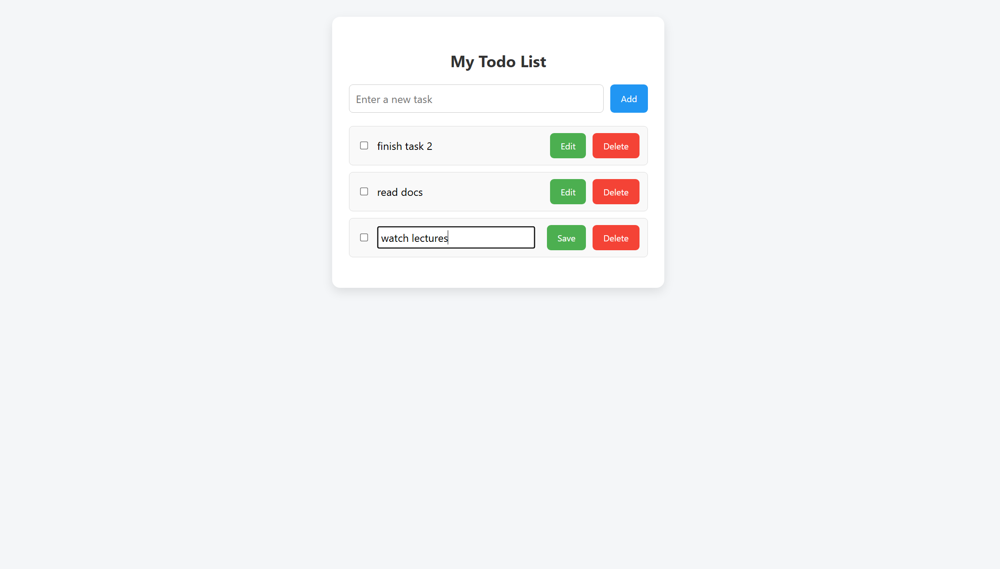
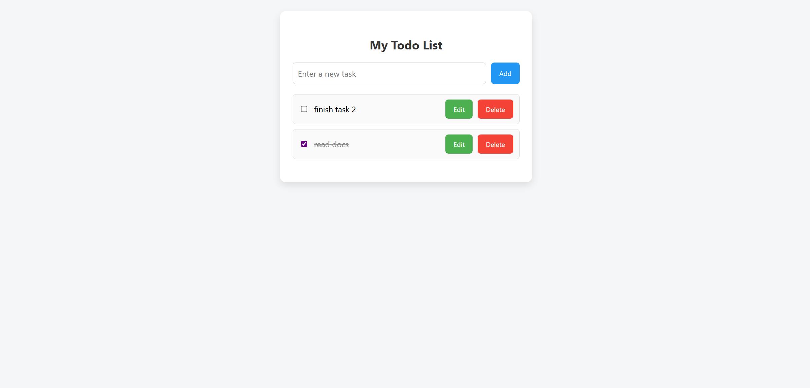
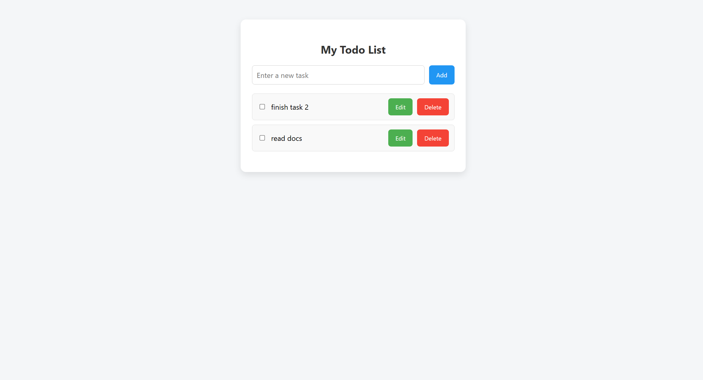

Simple To-Do List Web App

This is a simple and responsive To-Do List web application built using HTML, CSS, and JavaScript. It allows users to manage tasks efficiently; add, edit, mark as completed, and delete through a clean and user-friendly interface.

Features

- Add new tasks to the list
- Edit tasks inline without popups
- Mark tasks as completed
- Delete tasks from the list
- Simple and responsive design

Demo

1. Empty Task List

When the app loads with no tasks added yet, the interface shows an empty list.

2. Adding a Task

Enter a task in the input field and click the Add button. The new task will appear in the list.

3. Editing a Task

Click the Edit button next to a task. The task becomes editable directly in the list. Once edited, click Save to apply changes.

4. Completing a Task

Click the checkbox next to a task to mark it as completed. This applies a strikethrough to the task to indicate it's been completed.

5. Deleting a Task

Click the Delete button to permanently remove the task from the list.

How to Use

1. Download or clone the repository.
2. Open `index.html` in your browser.
3. Type your task into the input field.
4. Click Add to add it to the list.
5. Use Edit, Checkbox, or Delete for task management.

