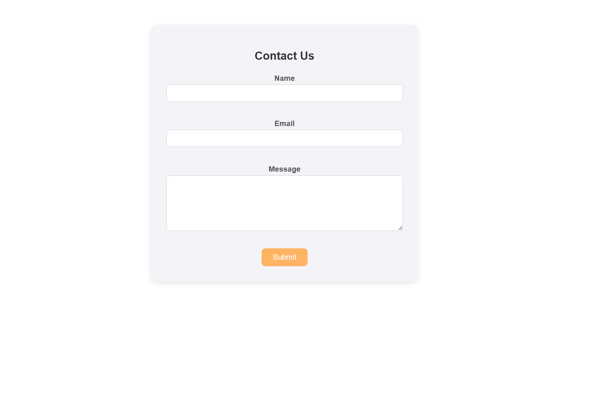
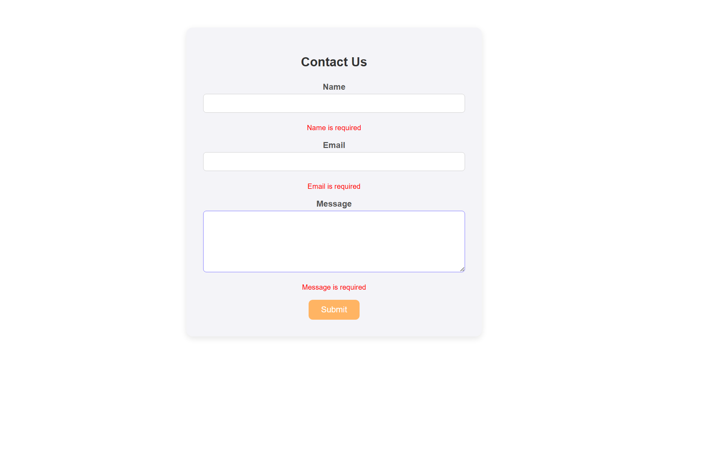
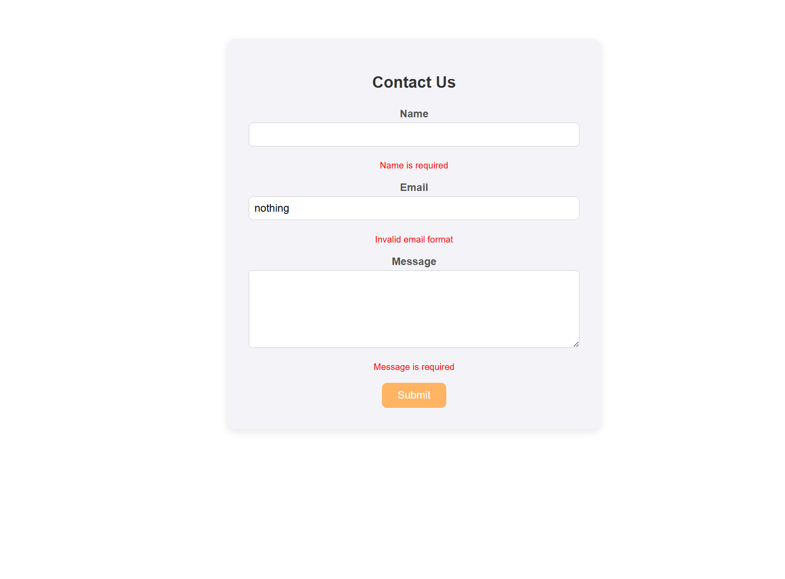
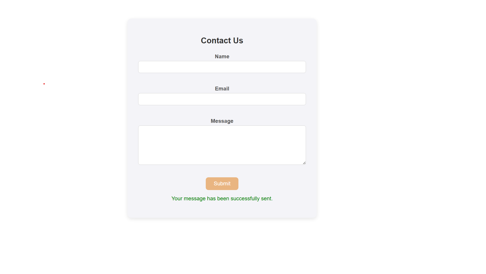

Contact Form App

This is a simple and responsive contact form built using React and the react-hook-form library.  
It allows users to input their name, email, and message, with real-time validation for each field.  
The form is styled with CSS and includes error handling and a success confirmation message.

The main functionality includes:
- Name, email, and message fields (all required)
- Email field is validated to ensure a proper email format
- Error messages are displayed when fields are empty or invalid
- A success message is shown when the form is submitted correctly

1. Form Interface

This shows the default appearance of the contact form before any input.

2. Required Field Error

When a user tries to submit the form without filling in the required fields, error messages appear.

3. Invalid Email Format

If the email entered does not match a valid email format, an error message like "Invalid email format" is displayed.

4. Successful Submission

Once all fields are filled out correctly and the form is submitted, a success message appears confirming that the message has been sent.

How to Run

1. Clone the repository:
2. Install dependencies:
   npm install
3. Start the development server:
   npm run dev

