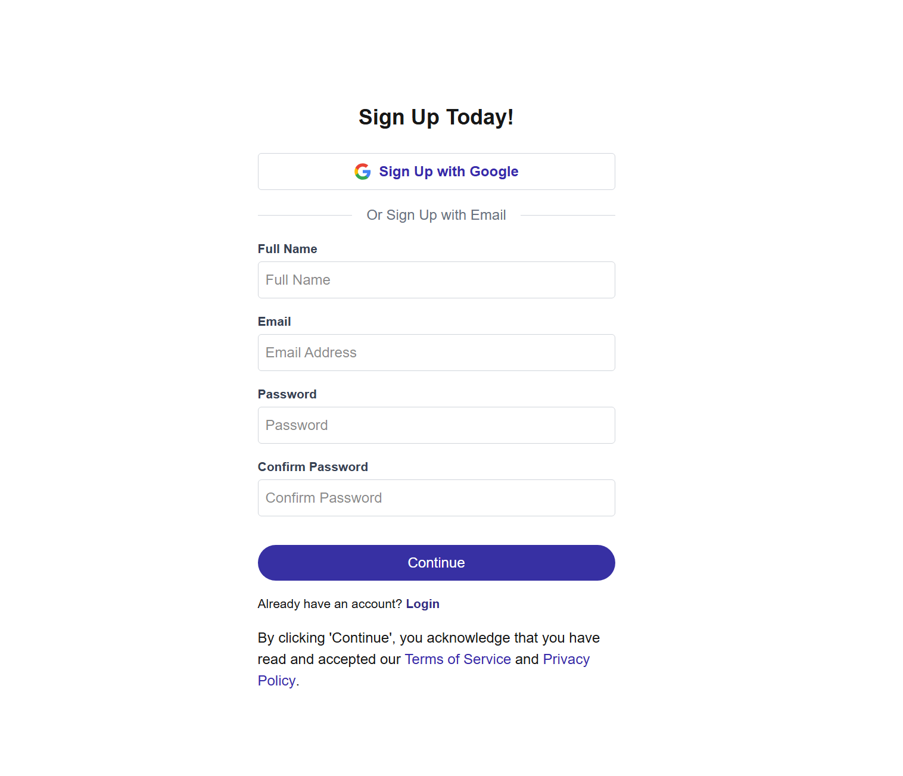

Job Listing App

This is a simple job listing web application built using Next.js, Tailwind CSS, and TypeScript. It fetches and displays a list of job posts  from an API and allows users to view more details about each job .It also has authentication logic,allows authenticated users to bookmark jobs and see all their bookmarked jobs in one place.

Main Features

- List of job postings on the homepage

- Individual job detail pages

-Login page

-SignUp page

-verify email page

-bookmarked jobs page

- Responsive layout using Tailwind CSS

Technologies

- Next.js 
- TypeScript
- Tailwind CSS
- React

Running the Project

1. Install dependencies:
   npm install

2. Start the development server:
   npm run dev

3. Open your browser and go to:
   http://localhost:3000

