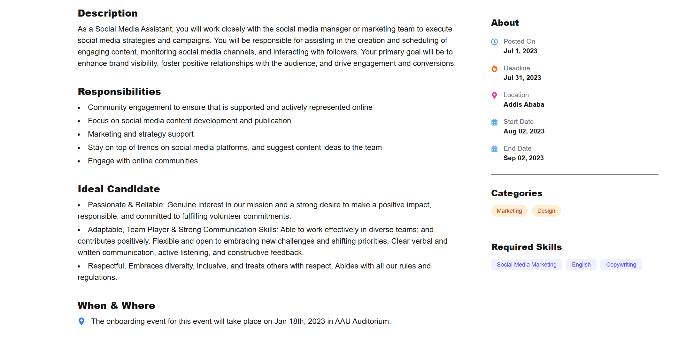

Job Listing App

This is a simple job listing web application built using Next.js, Tailwind CSS, and TypeScript. It displays a list of job posts and allows users to view more details about each job.

Main Features

- List of job postings on the homepage

- Individual job detail pages

- Responsive layout using Tailwind CSS

Technologies

- Next.js 
- TypeScript
- Tailwind CSS
- React

Running the Project

1. Install dependencies:
   npm install

2. Start the development server:
   npm run dev

3. Open your browser and go to:
   http://localhost:3000

